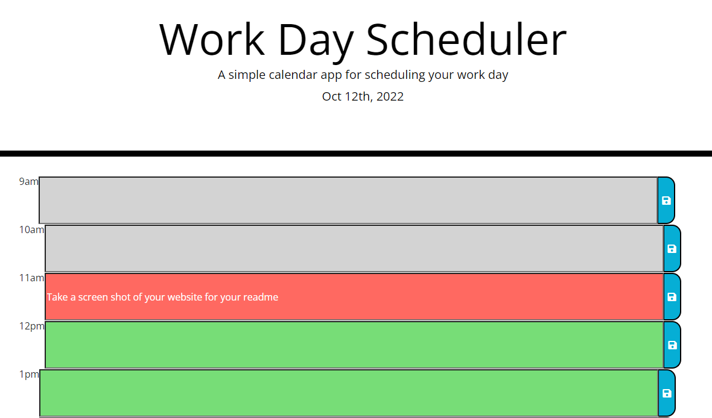

# Work Day Scheduler 

## Description 
The goal of this project was to create a work day scheduling calendar. The calendar displays grey for hours in the past, red for the current hour, and green for hours in the future. All tasks are saved to local storage and will be displayed when the user returns to the page. Technologies used were HTML, CSS, JavaScript, and jQuery. 

## Site Image

To visit the site click [here](https://samanthajanedavidson.github.io/work-day-scheduler/). 

## License
Please refer to the license in the repo. 
> Written with [StackEdit](https://stackedit.io/).